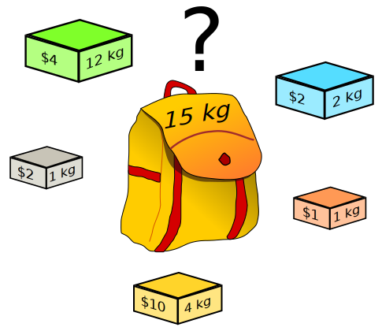

Quick start
=============

OptFrame is a C++ framework to solve challenging optimization problems, specially by means
of metaheuristic techniques.
It has no external dependencies, except a C++ compiler compatible with C++17 (or C++20).

After `installing <../install>`_ OptFrame (or just cloning it), user can start building
a solution to the problem at hand.

OptFrame Functional Core
------------------------

A useful abstraction was introduced since OptFrame 4.1, called OptFrame Functional Core (FCore).
The idea of FCore is to provide a simplified access to OptFrame programming classes, by means
of closures and lambdas. This way, a project that typically had 8 to 10 files is reduced to a single
file (all included in headers!).

Welcome Message
^^^^^^^^^^^^^^^

The first test on FCore is to see if it's correctly compiling. So let's just include its main header,
and print its `welcome()` message:

.. code-block:: c++

    // file: 'mytest.cpp'
    #include<iostream>
    #include<OptFCore/FCore.hpp>
    int main() {
        std::cout << optframe::FCore::welcome() << std::endl;
        return 0;
    }

To compile it and see the results (using GCC C++ compiler)::

    g++ --std=c++17 -fconcepts mytest.cpp -o fcore_mytest
    ./fcore_mytest
    # Welcome to OptFrame Functional Core (FCore) - version 4.1-dev

If a local copy of OptFrame is being used (via git clone), one needs to pass its location via flag `-I`
to the compiler (*considering relative location of ./optframe/src/*)::

    g++ --std=c++17 -fconcepts -I./optframe/src mytest.cpp -o fcore_localtest
    ./fcore_localtest
    # Welcome to OptFrame Functional Core (FCore) - version 4.1-dev

A deeper explanation of OptFrame theoretical foundations can be found on `Concepts <./concepts.html>`_
section, so we will move fast here!

First Example: 0-1 Knapsack Problem
-----------------------------------

Let's consider a classic problem: the 0-1 Knapsack Problem (KP).

|knapsack|
By: Dake `CC BY-SA 2.5 <https://commons.wikimedia.org/wiki/File:Knapsack.svg>`_

Given a set of items :math:`I`, the KP consists in selecting some items :math:`S \subseteq I`,
such that the sum of weights :math:`w_i` (for each selected item) do not exceed knapsack
capacity :math:`Q`, and profit :math:`p_i` of the selected items is maximized.

$$maximize\\; \\sum_{i \\in S} p_i$$
$$\\sum_{i \\in S} w_i \\leq Q$$
$$S \\subseteq I$$

Solution and Evaluation Types
^^^^^^^^^^^^^^^^^^^^^^^^^^^^^

Users must first define a *Representation*, which is a data structure that represents
an element in the *Solution Space* for the KP. A natural candidate here is an *array of booleans*, 
since we need to decide if we are going to carry each item or not. In C++, an interesting
approach is to use stl containers, such as a :code:`std::vector<int>`.
User also needs to specify the data type for the *Objective Space*, in general a numeric type.
In this case, we will simply choose 
an :code:`Evaluation<double>` (just ignore the *Evaluation* container for now...).

We declare a `XESolution <./concepts.html>`_ pair that aggregates both spaces as a type :code:`ESolutionKP`:

.. code-block:: c++

    // file: 'example.cpp'
    #include<iostream>
    #include<vector>
    #include<OptFCore/FCore.hpp>
    
    using namespace optframe;
    
    using ESolutionKP = std::pair<
        std::vector<bool>, // (representation)
        Evaluation<double> // (objective value)
    >;

Problem Context
^^^^^^^^^^^^^^^

Users will need to store general problem information (such as profits and weights of items),
so a *ProblemContext* can be introduced.
For easy interoperability with file and string inputs (on Linux/Windows), we use *Scanner* class
to process problem data (some details of 'load' function will only be discussed in a later moment):

.. code-block:: c++

    // example.cpp
    // ...
    #include <OptFrame/Scanner++/Scanner.hpp>
    using namespace scannerpp;

    class ProblemContext 
    {
    public:
        int n, Q;   // item count 'n' and knapsack capacity 'Q'
        std::vector<int> p, w; // profit 'p' and weight 'w' for each item

        // some 'load' function to read data from a Scanner
        void load(Scanner& scanner) {
            // reads data from scanner and store it on 'n', 'Q', 'p' and 'w' variables
            // details presented later...
        }
    };
    // global instance for problem data
    ProblemContext pKP;

Random Constructive
^^^^^^^^^^^^^^^^^^^

We need to have some initial solution for the search process, so we just proceed in a random manner.

. . . 